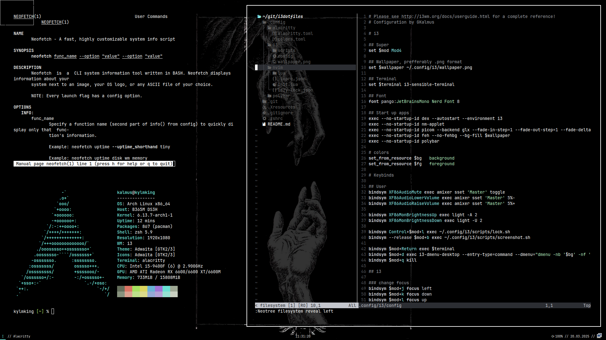

# Configuration files for i3 based window manager

## Installation

1. Clone the repository:
```sh
git clone https://github.com/GKalmus/i3dotfiles.git
cd i3dotfiles
```

2. Install the dependecies:
```sh
sudo pacman -Syu --needed i3-wm ttf-jetbrains-mono-nerd zsh picom \
neovim polybar adobe-source-han-serif-jp-fonts adobe-source-han-sans-kr-fonts \
imagemagick scrot xclip alacritty ly
```
3. Move configuration files:
```sh
cp -rf .config/* ~/.config/
cp -rf .Xresources ~/
cp -rf .zshrc ~/
```

## Screenshot

